# 架构师成长之路

## 前言
借用一下一张图


#  架构师筑基必备技能
## 并发编程进阶

### 线程共享和协作

1. CPU核心数，线程数，时间片轮转机制解读

  

  - CPU核心数 

    CPU核心数分为 物理CPU，单CPU上的核心数，以及逻辑CPU，具体区别可以查询[CPU逻辑核心数和物理核心数是什么意思?](https://zhidao.baidu.com/question/568786289.html)	在Java 中可以通过 ```Runtime.getRuntime().availableProcessors()``` 获取为逻辑CPU的数量为我们所说的CPU核心数。

  - 线程数 线程是CPU可以调度的最小单元，对于多线程线程数量的合理设置就显得很关键了，线程数过少可能不能发挥CPU的全部效能，线程数过大又会产生上下文切换反而会降低效能。关于线程数量的设置，在我观察中一般有两种策略，一种较为笼统简单，还有一种较为精准，首先谈第一种策略

    ##### 简单策略

    将CPU的效能转换为完成任务所需时间，用时越少代表效能越高，设定```任务所需用时=CPU用时+IO用时```

    根据其中CPU用时和IO用时占比不同分为 CPU密集型 IO密集型。对用CPU密集型的任务，线程数设置为**CPU核心数+1**因为使用CPU的时间较多，不建议设置过多线程数，导致频繁切换上下文；对于IO密集型的线程数设置为**CPU核心数*2**，因为CPU会长时间处于空闲状态所以可以设置多一些线程数，增加CPU的使用效能。此种策略的简单方面有二，其一是设置线程数量的公式较为简陋，其二是没有考虑到系统的其他性能如文件句柄上限的数量等

    ##### 复杂策略

    可以参考[Programming Concurrency on the JVM](./books/Programming Concurrency on the JVM.pdf)中Page32的一段话

    ```
    Number of threads = Number of Available Cores / (1 - Blocking Coefficient)
    ```

    > where the blocking coefficient is between 0 and 1.
    >
    > A computation-intensive task has a blocking coefficient of 0, whereas an IO-intensive task has a value close to 1—a fully blocked task is doomed, so we don’t have to worry about the value reaching 1.
    >
    > To determine the number of threads, we need to know two things:
    >
    > • The number of available cores
    > • The blocking coefficient of tasks
    >
    > The first one is easy to determine; we can look up that information, even at runtime, as we saw earlier. It takes a bit of effort to determine the blocking coefficient. We can try to guess it, or we can use profiling tools or the java.lang.management API to determine the amount of time a thread spends on system/IO operations vs. on CPU-intensive tasks.

  ​      这里的```(Blocking Coefficient)阻塞系数=IO用时/CPU用时+IO用时```，这里还提到了可以使用```java.lang.management```包中的工具检测程序CPU的使用时间，相关的[ThreadMXBean API链接](https://docs.oracle.com/javase/8/docs/api/)我写了一个列子如代码清单1-1

  ```java
  import java.lang.management.ManagementFactory;
  import java.time.LocalTime;
  import java.util.concurrent.TimeUnit;
  
  public class TaskTest implements Runnable{
  
      private static volatile boolean loop = true;
  
      public void run() {
          LocalTime end = null;
          LocalTime start = LocalTime.now();
          int IOSUMTIME = 5;
          try{
              //CPU计算
              cal(1000000);
  
              //模拟IO用时
              TimeUnit.SECONDS.sleep(IOSUMTIME);
  
              end = LocalTime.now();
  
          }catch (Exception e) {
  
              e.fillInStackTrace();
  
          }finally {
              System.out.println("总计耗时: " +( end.toNanoOfDay() - start.toNanoOfDay() / 1000000000.0) + "s");
              double total_cpu = ManagementFactory.getThreadMXBean().getCurrentThreadCpuTime()/1000000000.0;
              double user_cpu = ManagementFactory.getThreadMXBean().getCurrentThreadUserTime()/1000000000.0;
              System.out.println("总CPU耗时: " + total_cpu + "s");
              System.out.println("用户态CPU耗时: "+user_cpu +"s");
              System.out.println("IO耗时:"+IOSUMTIME+"s");
              double block_efficent = IOSUMTIME/(IOSUMTIME+total_cpu);
              System.out.println("阻塞系数: "+block_efficent);
              int cores = Runtime.getRuntime().availableProcessors();
              System.out.println("系统可用逻辑CPU核心数量:" + cores);
              System.out.println("此任务最佳线程数: " + cores/(1-block_efficent));
  
          }
  
  
      }
  
  
      public void cal(long lopp_cyc){
  
          double sum = 0;
  
          for(int i = 0;i<lopp_cyc;i++){
  
              sum = sum + i * i + Math.pow(2.0,Double.valueOf(i));
  
          }
  
      }
  }
  ```

  <center>代码清单1-1</center>
  运行结果如下

  ```
  总计耗时: 7.2238589927767E13s
  总CPU耗时: 0.71567s
  用户态CPU耗时: 0.702647s
  IO耗时:5s
  阻塞系数: 0.8747880825869933
  系统可用逻辑CPU核心数量:4
  此任务最佳线程数: 31.945840960219083
  ```

* 时间片轮转机制

  时间片轮转机制即单个CPU核心会不停的切换不同的线程，进程进行运行，由此产生了上文所说的上下文切换的问题。

2. synchronized/volatile/ThreadLocal

  [Java8全部官方文档](https://docs.oracle.com/javase/8/docs/)

  * synchronized

    **原子性 顺序性 可见性**

    **可重入**

    [Chapter17.1 Synchronization](./books/jls8.pdf#page=660&zoom=100,0,89)

    > The Java programming language provides multiple mechanisms for
    > communicating between threads. The most basic of these methods is
    > synchronization, which is implemented using monitors. Each object in Java is
    > associated with a monitor, which a thread can lock or unlock. Only one thread at
    > a time may hold a lock on a monitor. Any other threads attempting to lock that
    > monitor are blocked until they can obtain a lock on that monitor. **A thread t may
    > lock a particular monitor multiple times; each unlock reverses the effect of one
    > lock operation.**

    此段文献中明确说明了同一个线程是可以对同一个监视器拿锁多次。**(Synchronization是可重入的)**

    [Chapter3.14 Synchronization底层实现细节](./books/jvms8.pdf)

    > Synchronization in the Java Virtual Machine is implemented by monitor entry and
> exit, either explicitly (by use of the monitorenter and monitorexit instructions) or
    > implicitly (by the method invocation and return instructions).
> For code written in the Java programming language, perhaps the most common
    > form of synchronization is the  synchronized method. **A  synchronized method is**
    > **not normally implemented using monitorenter and monitorexit. Rather, it is simply**
    > **distinguished in the run-time constant pool by the  ACC_SYNCHRONIZED flag, which**
    > **is checked by the method invocation instructions (§2.11.10).**


此段说明了对于同步代码块使用的是monitorenter 与 monitorexit ,但对于同步方法略有不同使用的是常量池里的ACC_SYNCHRONIZED 标志位辨别同步。

**死锁的发生**

1. 持有D锁的线程A在等待B锁，持有B锁的线程C在等待D锁，接下来通过代码演示

```java
   package thread_share;
       
   public class A_Task implements Runnable {
       private Object a;
   
       private Object c;
   
       public A_Task(Object a,Object c){
           this.a = a;
           this.c = c;
       }
   
       @Override
       public void run() {
   
           synchronized (a){
   
               Flag.A_Ready = true;
   
               System.out.println("A_Task get a");
   
               while(!Flag.A_Ready || !Flag.B_Ready){
   
               }
               synchronized (c){
   
                   System.out.println("A_Task get c");
   
               }
   
           }
   
       }
   }
```


​    
```java
 package thread_share;
 public class B_Task implements Runnable {
 	private Object a;

    private Object c;
    public B_Task(Object c,Object a){

        this.a = a ;
        this.c = c;

    }

    @Override
    public void run() {

        synchronized (c){

            Flag.B_Ready = true;

            System.out.println("B_Task get c");

            while(!Flag.A_Ready || !Flag.B_Ready){

            }
            synchronized (a){

                System.out.println("B_Task get a");

            }

        }

    }
}


```


​    
```java
package thread_share;
public class Flag {
	public static volatile boolean A_Ready = false;
    public static volatile boolean B_Ready = false;
}

```


​    
```java
 package thread_share;
 public  class Test {
 	public static void main(String[] args) {

        Object a = new Object();

        Object c = new Object();

        new Thread(new A_Task(a,c)).start();

        new Thread(new B_Task(c,a)).start();
  		    }
 }
```


最后的结果截图如下

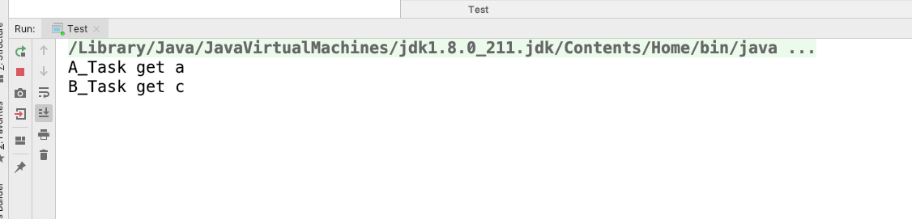

从结果中可以看出A_Task进展到拿对象c的锁这一步停滞不前，B_Task进展到到拿a的锁这一步停滞不前，原因就是发生死锁了。

知道了死锁如何避免死锁的

这里直接参考[死锁，死锁的四个必要条件以及处理策略](https://blog.csdn.net/wljliujuan/article/details/79614019)

死锁的四个必要条件为

#### 互斥条件：

进程要求对所分配的资源（如打印机）进行排他性控制，即在一段时间内某资源仅为一个进程所占有。此时若有其他进程请求该资源，则请求进程只能等待。

#### 不可剥夺条件:

进程所获得的资源在未使用完毕之前，不能被其他进程强行夺走，即只能由获得该资源的进程自己来释放（只能是主动释放)。

#### 请求与保持条件：

进程已经保持了至少一个资源，但又提出了新的资源请求，而该资源已被其他进程占有，此时请求进程被阻塞，但对自己已获得的资源保持不放。

#### 循环等待条件:预防死锁

存在一种进程资源的循环等待链，链中每一个进程已获得的资源同时被 链中下一个进程所请求。即存在一个处于等待状态的进程集合{Pl, P2, …, pn}，其中Pi等 待的资源被P(i+1)占有（i=0, 1, …, n-1)，Pn等待的资源被P0占有，如图2-15所示。

直观上看，循环等待条件似乎和死锁的定义一样，其实不然。按死锁定义构成等待环所 要求的条件更严，它要求Pi等待的资源必须由P(i+1)来满足，而循环等待条件则无此限制。 例如，系统中有两台输出设备，P0占有一台，PK占有另一台，且K不属于集合{0, 1, …, n}。

Pn等待一台输出设备，它可以从P0获得，也可能从PK获得。因此，虽然Pn、P0和其他 一些进程形成了循环等待圈，但PK不在圈内，若PK释放了输出设备，则可打破循环等待, 如图2-16所示。因此循环等待只是死锁的必要条件。

#### 预防死锁

**以上这四个条件是死锁的必要条件，只要系统发生死锁，这些条件必然成立，而只要上述条件之一不满足，就不会发生死锁。**

****

再次分析一下 互斥条件和不可剥夺 为synchronized 的实现原理无法改变，可以从请求与保持条件,循环等待条件

  * volatile

    顺序性 可见性

    [JMM模型](https://www.jianshu.com/p/47f999a7c280)

    Happen Before原则

    - 单线程happen-before原则：在同一个线程中，书写在前面的操作happen-before后面的操作。
  - 锁的happen-before原则：同一个锁的unlock操作happen-before此锁的lock操作。
    
    - volatile的happen-before原则：对一个volatile变量的读操作happen-before对此变量的任意操作(当然也包括写操作了)。
  - happen-before的传递性原则：如果A操作 happen-before B操作，B操作happen-before C操作，那么A操作happen-before C操作。
    - 线程启动的happen-before原则：同一个线程的start方法happen-before此线程的其它方法。
    - 线程中断的happen-before原则：对线程interrupt方法的调用happen-before被中断线程的检测到中断发送的代码。
    - 线程终结的happen-before原则：线程中的所有操作都happen-before线程的终止检测。
    - 对象创建的happen-before原则：一个对象的初始化完成先于他的finalize方法调用。
    
    
    32位机器上 Long和Double的写诗非原子操作，读在JSR133后是原子操作之前也是非原子操作，因为Long和Double是4字节64位

  * ThreadLocal源码独家揭秘

    

    Thread->ThreadLocalMap->Entry[]->Entry WeakReference<ThreadLocal<?>>->key->value

    死锁 内存泄露
    
    线程上下文事务回滚
    
    connection
    数据库连接池的应用
    
    #### Description
   ```java
    public class DaoTemplate{
    
    ThreadLocal<Connection> conection_local = new ThreadLocal<Connection>();
    
    private getConnction(){
    
       if(conection_local.get() == null){
          
          conection_local.set(ConnectionManager.getConection());
       
       }else{
       
       return conection_local.get();
       
       } 
    }
    private closeConnction(){   
        if(conection_local.get() != null){    
        conection_local.remove();
        }   
    }
    abstract void run(Connection connection);
    
    protected void bussiness(){
      try{ 
         run(getConnection());
      }catch(EXception e)
      {
        throw new SQLExcpetion();
      }finally{
        closeConnction();
      }
     }   
    }
   ```

3. wait/notify/notifyAll/Join

   wait/notify/notifyAll/Join 的底层实现也是基于mintoerenter 与 mointoerexit 所以必须要在同步代码块中进行使用  

### 线程池

#### 线程池的使用

[阿里云Java开发手册](./books/java.pdf)

#### 线程池底层原理

#### Executor原理

Executor 

Thread

ThreadFactory

ThreadPoolExecutor

Worker 

AbstractQueuedSynchronizer


AbortPolicy

DiscardPolicy

DiscardOldestPolicy


## JVM性能深度调优

#### 自动垃圾收集

自动垃圾回收查看堆内存，识别正在使用哪些对象以及哪些对象为被删除，删除未使用对象的过程 

使用中的对象或引用的对象意味着程序的某些部分仍然维护指向该对象的指针。

不同类型内存对象失效的判断方式

##### 对象回收-引用计数   会存在 循环引用

对象回收-可达性分析

##### 可达性分析算法，将对象及其引用看作一个图，选定活动对象作为GC Roots;（在回收清除后存在内存碎片的问题）

然后跟踪引用链条，如果一个对象和GC Roots之间不可达，也就是不存在引用，认定是可回收对象

GC Root对象

1. 虚拟机栈中**正在引用**的对象

2. 本地方法栈中**正在引用**的对象
3. 静态属性引用的对象
4. 方法区常量引用的对象

###### Java中引用类型

1. 强引用 

   ```Object o = new Object()``` 只要有强引用指向对象，就不会被回收

2. 软引用

   ```SoftReference<Object> so =new SoftReference<Object> ()``` JVM认为内存不足时，才会试图回收软引用指向的对象（缓存）

3. 弱引用

   ```WeakReference<Object> wo = new WeakReference<Object>()``` ```WeakReference```即使有引用指向，也随时可能被回收掉。ThreadLocalMap Entry中的key为WeakReference<ThreadLocal>,所以使用ThreadLocal存在内存泄漏的风险

4. 虚引用

   不能通过它访问对象，当对象被finalize后，执行指定逻辑的机制，一般为JVM内部使用

###### **可达性级别**

1. 强可达

 	2. 软可达
 	3. 弱可达
 	4. 幻像可达
 	5. 不可达

##### 复制算法  （空间浪费 ）

划分两块同等大小的区域，收集时活着的对象复制到另一块区域

拷贝过程中将对象顺序放置，就可以避免内存碎片。复制+预留内存，有一定的浪费

**新生代使用的为复制算法**

##### 标记整理（Mark-Compact）

类似标记，避免内存碎片化，在清理过程中将对象移动，以确保移动后的对象占用连续的内存空间。

##### 方法区回收

#### 垃圾收集器

##### 串行收集器（stop-the-world,）-XX:+UseSerialGC /-XX:+UseSerialOldGC

单个线程来执行所有垃圾收集，适合单处理器，是Client模式下JVM的默认选项

stop-the-world,单线程执行垃圾收集时，会将所有用户线程停止

-XX:+UseSerialOldGC可以用于老年代，采用标记-整理算法 新生代为标记复制算法

##### 并行收集器（stop-the-world）-XX:+UseParallelGC -XX:+UsePrallelOldGC

整体上算法和Serial相似，区别是 新生代和老年代的GC活动是并行执行，可以设置GC时间或吞吐量

吞吐量 = 用户代码运行时间/（用户代码运行时间+GC时间）

可以设置ParallelGCThreads 用于垃圾回收的线程数量。通常情况下和CPU数量相等。

MaxGCPauseMills,设置最大垃圾收集停顿时间

GCTimeRatio,设置吞吐量大小

UseAdaptiveSizePolicy 打开自适应GC策略

##### 并发收集器（用于老年代，清除算法  GC -XX:+UseConcMarkSweepGC）

为了减少停顿时间，采用标记-清除算法，存在内存碎片化问题，长时间运行会发生full GC，会占用CPU资源，和用户线程争抢

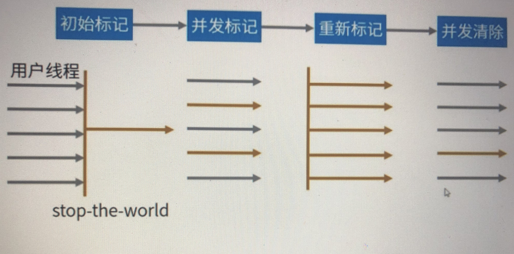

首先会stop-the-world快速标记GC Root,然后并发标记对象是否正在使用，然后会再次stop-the-world重新标记所有的对象,最后并发清除

##### 并行收集器（用于新生代GC Serial GC多线程版本）-UseParNewGc

多个回收线程回收新生代

可以控制线程数量 -XX:ParallelGCThreads

常见的应用场景配合老年代CMS GC工作。参数-XX:+UseConcMarkSweepGC

##### **常见垃圾回收器的优化**

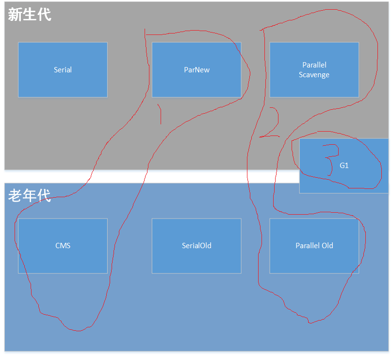

1. CMS+ParNew
2. Parallel Scavenge + Parallel Old
3. G1

#### JDK内置工具

##### javap

反汇编工具，主要用于根据Java字节码文件反汇编Java源代码文件

javap <option> <classes>

javap -v verbose 输出附加信息

##### jps

JavaVirtualMachineProcessStatusTool

jps [options] [hostid] 显示当前所有Java进程pid的命令

##### jstat

[jstat的命令手册](./books/jstat.pdf)

监视Java虚拟机统计信息

jstat -t 参数 在输出信息前面加上一个Timestamp列，显示程序运行时间

-h 参数 在周期性的数据输出时。输出多少行数据后，跟着输出一个表头信息

interval 执行输出统计周期，count指定输出多少次数据


##### jcmd 

代替jps工具查看本地的jvm信息

##### jmap

打印内存信息

##### jstack 

打印线程信息


##### JConsole

##### JVisualVm

#### 调优的基本概念

##### 主要目标：

###### 响应性

应用程序就或者系统对请求的数据进行响应的速度，对于专注于响应性的应用程序，长的暂停时间是不可接受的，重点是短时间内做出回应。

###### 吞吐量

侧重于在特定时间段内最大化应用程序的工作量，对于专注于吞吐量的应用程序，高暂停时间是可接受的，高吞吐量应用程序在较长时间内专注与基准测试，因此不需要考虑快速响应时间。

##### 堆大小调整

##### 垃圾收集器调整

###### 优化思路

1. 分析长颈

   启动速度慢；偶尔出现影响慢

2. 确定目标

   内存占用，低延时，吞吐量

3. 收集日志

   通过参数配置收集GC日志

4. 分析日志

   使用工具辅助分析日志，查看GC次数，GC时间

5. 调整参数

   切换垃圾收集器或者调整垃圾收集器参数

###### 优化实例步骤

1. 参数优化设置

   

   

   

2. jcmd 查看当前jvm中运行程序的进程id

3. 使用jmap 根据 pid 获取 堆信息 ```jmap -heap pid``` 发现新生代使用的是复制算法

4. jstat -gc -h10 $(jcmd | grep '${program}' | awk 'print $1') 1000

##### JIT编译器

JIT编译器对性能也有很大影响，但很少需要对新版本的JVM进行调优


## 网络编程与高效IO

### 零拷贝
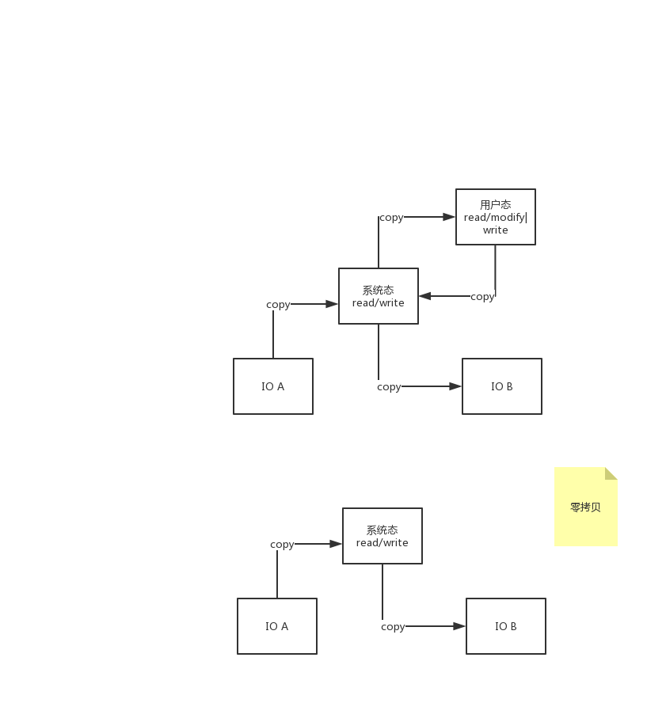

零拷贝的实现参考本文章

[ZeroCopy](./books/JavaZeroCopy.pdf)

### BIO NIO AIO

IO通信 分为两步 1. io请求发送  2. io的write read 

第一步请求方式的不同分为 阻塞 非阻塞

第二步 从app 到system io的write 和 read 不同分为 同步 异步

## 深入Tomcat底层

### 线程隔离

##### 类加载

静态代码块只会在类被第一次使用时触发

##### 类卸载

当类加载器为null，并且不存在该类的对象引用，该类会被卸载

##### 双亲委派

首先是双亲委派 这里就不再具体描述 直接上图了

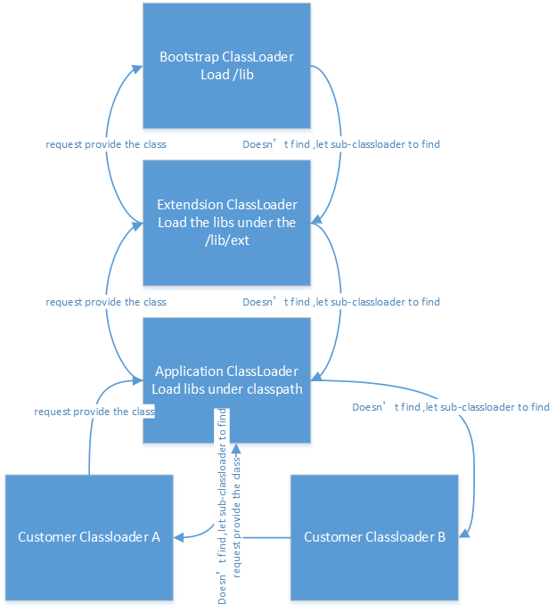

当然有些时候我们也需要打破双亲委派，例如Java的SPI机制，可以点击此我的这篇文章[Java SPI机制](./Java SPI机制.md)进行查看

## MYSQL深度优化

#### 本人真实项目案例

1. 使用自定义函数执行带有逻辑的操作，优化思路，尽量将复杂的逻辑，拆分成多个简单操作，并将操作结果以临时表的形式保存下来（借用mysql的索引提高后续查询效率），供后续操作使用，有种空间换时间的感觉。

记录一次项目中出现的函数执行过慢

```mysql
BEGIN

#Routine body goes here...

  declare hostId varchar(60) ;  

declare done int default 0;

#declare hostId varchar; 

declare idCur cursor for select ay.id from ay;

declare continue handler for not FOUND set done = 1;

open idCur;

   REPEAT

     fetch idCur into hostId; 
	    	if not done THEN
	
			   	update ay set ay.m=(CASE STRCMP("5",LEFT(ay.o,1)) when 0 then LEFT(ay.o,8) else "" END) where CONVERT(ay.id USING utf8) COLLATE utf8_unicode_ci = hostId;
   
      end if;

until done end repeat;

  close idCur;

RETURN 0;

END
```

执行过程相当慢，因为是单次一次一次完成update操作，以及where id的设置所以理所当然会很慢，而且使用了自定义函数 所以基本是没有走索引的，使用explain可以看出来,执行一千条需要6秒

优化方案

创建表b字段为id，id的来源是 selelct id from a,

然后重新执行新的语句

```mysql
UPDATE b,ay
SET ay.m = (
	CASE STRCMP(
		"5",
		LEFT (
			ay.o,
			1
		)
	)
	WHEN 0 THEN
		LEFT (
			ay.o,
			8
		)
	ELSE
		""
	END
)
WHERE
	CONVERT (
		ay.id USING utf8
	) COLLATE utf8_unicode_ci = b.id;
```

此时一千条数据只需要0.666s

### MYSQL备份

mysqldump -hIP -pPORT -uUSERNAME -pPASSWORD DATABASENAME | gzip  >  BACKUPFILEPAT.gz

mysqldump -hIP -pPORT -uUSERNAME -pPASSWORD DATABASENAME <  BACKUPFILEPAT.sql

### MYSQL事务及隔离性级别

##### 参考

[何为脏读、不可重复读、幻读](http://ifeve.com/db_problem/)

##### 定义

事务是用于查询或修改数据库各项数据的最小执行单元

##### 特性

* 原子性（atomicity）。一个事务是一个不可分割的工作单位，事务中包括的诸操作要么都做，要么都不做。

* 一致性（consistency）。事务必须是使数据库从一个一致性状态变到另一个一致性状态。一致性与原子性是密切相关的。

* 隔离性（isolation）。一个事务的执行不能被其他事务干扰。即一个事务内部的操作及使用的数据对并发的其他事务是隔离的，并发执行的各个事务之间不能互相干扰。

* 持久性（durability）。持久性也称永久性（permanence），指一个事务一旦提交，它对数据库中数据的改变就应该是永久性的。接下来的其他操作或故障不应该对其有任何影响。

由于是最小的执行单元,所以天然具有原子性 与 一致性

持久性应该是属于数据库的特性,既然事务是对数据库各项数据的查询与修改那么也必然是具备持久性的

隔离性特性的产生的原因 有些类似于多线程共享资源的处理 但不完全一样,为了解决事务并发带来的问题，才有了事务规范中的四个事务隔离级别

有以下几种事务并发问题情况的出现

测试数据

```sql
insert into table value(1,5)
insert into table value(2,6)
insert into table value(3,3)
insert into table value(4,7)
```

1. 脏读

   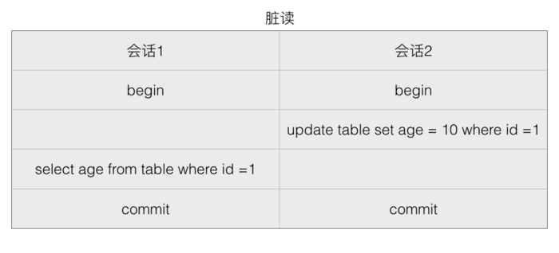

   是指一个事务读取到了其他事务没有提交的数据

   会话1在会话2 update 后读到的age为 10 ,但是 会话2 可能update 后 不commit 执行 rollback

2. 不可重复读

   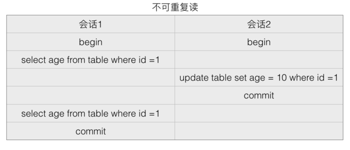

   一个事务内多次根据同一个查询条件查询出来的同一行记录的值不一样

   会话1在第一次读到的age是5,然后会话2 update 为 10 并且 提交 会话1 再次读取 age变为 10 ,两次读取结果不一样

3. 幻读

   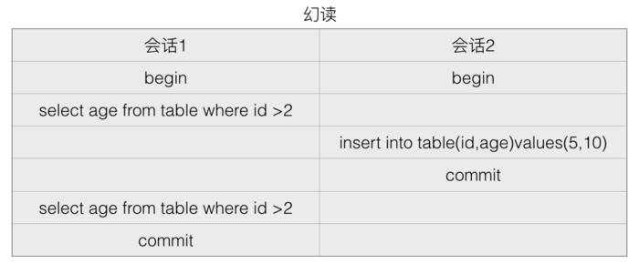

   一个事务内多次根据同个条件查出来的记录行数不一样

   会话1第一次查询结果为2,会话2 insert 新数据,会话1再次查询 结果为 3

##### 隔离级别与问题

针对隔离性各大数据库厂商有着自己的解决方案,主要有以下几种

```
TRANSACTION_NONE                  不支持事务
TRANSACTION_READ_COMMITTED        支持事务               不防止 脏读 不可重复读 幻读
TRANSACTION_READ_UNCOMMITTED      防脏读                不防止 不可重复读 幻读
TRANSACTION_REPEATABLE_READ       防脏读 不可重复读       不防止 幻读
TRANSACTION_SERIALIZABLE          防脏读 不可重复读 幻读
```

Mysql 在 防止不可重复读 是存在一些争议的

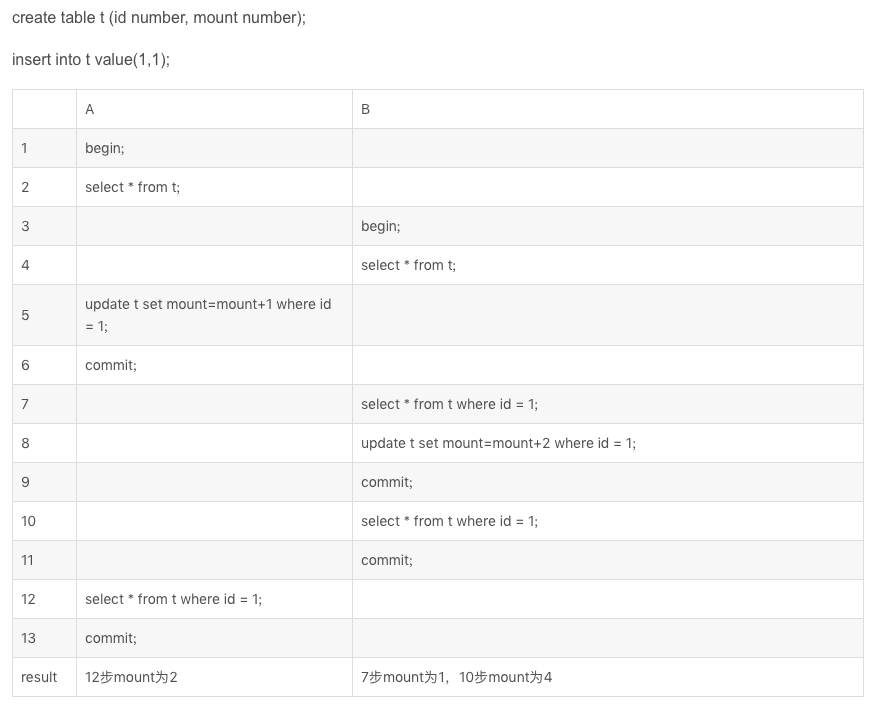

TODO

## 架构基础必备Linux

# 设计思想解读和开源框架

## 六大原则

开闭 里氏替换 

## 结构型模式


## 创建型模式

单例 模板 

### 单例

懒汉式单例 与 读写锁的联系 与 数据库的事务隔离级别

//TODO

## 行为型模式

职责链 。。。

## Spring5源码解读

### 源码下载安装

使用idea下载最新的Spring版本

进入spring-core目录执行下面两个命令

`gradle objenesisRepackJar`

`gradle cglibRepackJar`

因为spring-core模块依赖着两个包,但是这两个包饼没有被打包进来需要手动加入依赖

我们一定会用到spring-context模块,此时我们需要先修改spring-context模块的build.gradle将其中的 compile(project(":spring-aop"))注释,暂时用不到,还有将optional(project(":spring-instrument"))修改为compile(project(":spring-instrument"))

接下来开始第一次的
---

Spring IOC创建Bean对象

IOC中做重要的BeanFactory 定义了获取Bean对象功能，以及一些基本Bean属性判断的功能

如判断是否为单例，是否是原型创建模式，获取Bean的别名，获取BeanProvider , 其中还有一个特别的内容就是定义了

FactoryBean的BeanName前加上& 和他自己创建的Bean对象 区别 

```String FACTORY_BEAN_PREFIX = "&";```

这个的具体意思话不多说直接上案例和结果

实现 FactoryBean 

```java
@Componentpublic class BeanGenerateCase implements FactoryBean<String> {   
    @Override   public String getObject() throws Exception {      
        return "GeneratorObject";   
    }   
    @Override   
    public Class<?> getObjectType() {      
        return String.class;   
    }   
    @Override   
    public boolean isSingleton() {      
        return false;   
    }
}
```

获取FactoryBean

```java
public static void main(String[] args) {   
    AnnotationConfigApplicationContext annotationConfigApplicationContext = new AnnotationConfigApplicationContext();   
    annotationConfigApplicationContext.scan("com.test");                  
    annotationConfigApplicationContext.refresh();       
    System.out.println(annotationConfigApplicationContext.getBean("beanGenerateCase"));   
    System.out.println(annotationConfigApplicationContext.getBean("&beanGenerateCase"));
}
```

结果为

`GeneratorObject`
`com.test.BeanGenerateCase@1b4fb997`

所以可以看出当Bean为FactoryBean及产生其他bean的bean的时候，他本身的beanname 需要在首字母小写的类名前加上取地址符号&才是class本身的Bean，没有加的取的是生成的bean


接下来简单看一下有哪些实现了BeanFactory的内容

首先看一下BeanFactory的注释可以发现，BeanFactory明确规范了bean对象的各阶段生命周期以及顺序

```java
 /**
 * @see BeanNameAware#setBeanName
 * @see BeanClassLoaderAware#setBeanClassLoader
 * @see BeanFactoryAware#setBeanFactory
 * @see org.springframework.context.ResourceLoaderAware#setResourceLoader
 * @see org.springframework.context.ApplicationEventPublisherAware#setApplicationEventPublisher
 * @see org.springframework.context.MessageSourceAware#setMessageSource
 * @see org.springframework.context.ApplicationContextAware#setApplicationContext
 * @see org.springframework.web.context.ServletContextAware#setServletContext
 * @see org.springframework.beans.factory.config.BeanPostProcessor#postProcessBeforeInitialization
 * @see InitializingBean#afterPropertiesSet
 * @see org.springframework.beans.factory.support.RootBeanDefinition#getInitMethodName
 * @see org.springframework.beans.factory.config.BeanPostProcessor#postProcessAfterInitialization
 * @see DisposableBean#destroy
 * @see org.springframework.beans.factory.support.RootBeanDefinition#getDestroyMethodName
 **/
```

一个Bean对象的初始化过程会先回调各阶段Aware接口，在销魂Bean的时候也会先回调DisposableBean和RootBeanDefinition接口

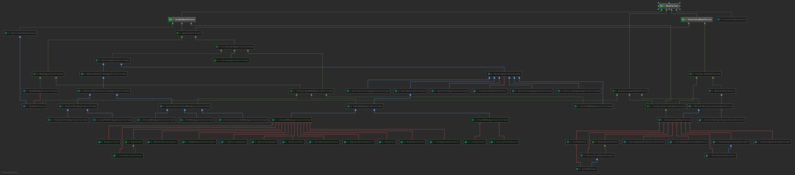


#### Spring世界中Bean个体的奇妙

先看一个最简单的Bean与Spring应用

```java
import org.springframework.stereotype.Component;


@Component
public class GenericBeanOfXiaoWu {

	private String username;

	private Integer age;

	public String getUsername() {
		return username;
	}

	public void setUsername(String username) {
		this.username = username;
	}

	public Integer getAge() {
		return age;
	}

	public void setAge(Integer age) {
		this.age = age;
	}

	@Override
	public String toString() {
		return "GenericBeanOfXiaoWu{" +
				"username='" + username + '\'' +
				", age=" + age +
				'}';
	}

}
```

```java
	public static void main(String[] args) {

		AnnotationConfigApplicationContext annotationConfigApplicationContext = new AnnotationConfigApplicationContext();
		annotationConfigApplicationContext.scan("com.test");
		annotationConfigApplicationContext.refresh();
		GenericBeanOfXiaoWu gboxw = annotationConfigApplicationContext.getBean(GenericBeanOfXiaoWu.class);
		System.out.println(gboxw);

	}
```

结果

```GenericBeanOfXiaoWu{username='null', age=null}```

怎么样是不是很简单,那么这个简单Bean产生过程中到底都经历了些什么呢，我们今天就一探究竟

1.```AnnotationConfigApplicationContext annotationConfigApplicationContext = new AnnotationConfigApplicationContext();```

看到其构造内部

```java
	private final AnnotatedBeanDefinitionReader reader;

	private final ClassPathBeanDefinitionScanner scanner;
```


```java
	public AnnotationConfigApplicationContext() {
		this.reader = new AnnotatedBeanDefinitionReader(this);
		this.scanner = new ClassPathBeanDefinitionScanner(this);
	}
```

那么这个 ```AnnotatedBeanDefinitionReader``` 与 ```ClassPathBeanDefinitionScanner```又是何许类

```java
	public AnnotatedBeanDefinitionReader(BeanDefinitionRegistry registry) {
		this(registry, getOrCreateEnvironment(registry));
	}
```

```java
private static Environment getOrCreateEnvironment(BeanDefinitionRegistry registry) {
		Assert.notNull(registry, "BeanDefinitionRegistry must not be null");
		if (registry instanceof EnvironmentCapable) {
			return ((EnvironmentCapable) registry).getEnvironment();
		}
		return new StandardEnvironment();
	}
```

首先判断传入的```AnnotationConfigApplicationContext```是否实现了```EnvironmentCapable```接口，如果实现了则转型并获取当前应用程序的环境，如果没有则返回标准环境，那么```Environment``` 是什么接口呢，我们看一下

//TODO

```Environment```接口主要是提供了获取配置profile的功能和属性properties的功能

---


 定义bean标签>将bean标签解析成BeanDefinition>调用构造方法实例化(IOC)>属性值得依赖注入(DI)>@PostConstruct>InitializingBean>BeanFactoryPostProcess>BeanPostPorcess.postProcessBeforeInitialization>bean的init方法>BeanPostPorcess.postProcessAfterInitialization>...>destory>@PreConstruct

 

* BeanFactoryPostProcess 
  处理bean factory 拿到 依赖注入完毕的bean工厂,通过beanfactorypostprocess接口拿到 bean工厂,并拿到特定的BeanDefinition 并修改bean的属性 如scope lazyinit ... 具体看 bean definition

 * BeanPostProcess
   
   调用InitializingBean接口的afterProperties()

   在bean的init方法前后执行
   对Bean进行处理
   
* InitializingBean

在所有的Bean注入成功后执行一次方法


* FactoryBean 
创建复杂的bean对象


* PostFactoryBean

* @PostConstruct @PreConstruct

@PostConstruct @PreConstruct是java5 引入的注解,针对serlvet生命周期的扩展点
服务器加载servlet类->servlet 构造函数的运行加载 -> 执行@postconstruct的方法 只会执行一次-> init (servlet)只执行一次->service()每次请求都会执行并且根据请求类型调用不同的doPost/doGet->destory销毁serlvet对象->执行@preConstruct的方法 只执行一次-> 服务器卸载serlvet


 BeanDefinitionRegistryPostProcessor 在所有的BeanFactoryPostProcessor中最先执行甚至可以修改 其他BeanFactoryPostProcessor


### Aop的原理

### Transaction

#### 声明式事务底层

#### 事务处理

#### 传播监控

#### springJdbc 写ORM

### SpringMvc框架源码解读

##### 使用

```xml
<!-- Spring MVC配置 -->
<!-- ====================================== -->
<servlet>
    <servlet-name>spring</servlet-name>
    <servlet-class>org.springframework.web.servlet.DispatcherServlet</servlet-class>
    <!-- 可以自定义servlet.xml配置文件的位置和名称，默认为WEB-INF目录下，名称为[<servlet-name>]-servlet.xml，如spring-servlet.xml
    <init-param>
        <param-name>contextConfigLocation</param-name>
        <param-value>/WEB-INF/spring-servlet.xml</param-value>&nbsp; 默认
    </init-param>
    -->
    <load-on-startup>1</load-on-startup>
</servlet>

<servlet-mapping>
    <servlet-name>spring</servlet-name>
    <url-pattern>*.do</url-pattern>
</servlet-mapping>

<!-- Spring配置 -->
<!-- ====================================== -->
<listener>
   <listenerclass>
     org.springframework.web.context.ContextLoaderListener
   </listener-class>
</listener>

<!-- 指定Spring Bean的配置文件所在目录。默认配置在WEB-INF目录下 -->
<context-param>
    <param-name>contextConfigLocation</param-name>
    <param-value>classpath:config/applicationContext.xml</param-value>
</context-param>

#### dispatcherservlet  
```

#### 多个请求之间的单例controller如何保证 变量不被污染 

#### requestContextHolder

#### ThreadLocal 保证多线程之间 状态bean 的安全性

#### 关于状态bean和无状态bean的区别

##### 状态Bean

##### 无状态Bean

Spring Mvc如何针对状态Bean实现单例操作

#### 与IOC容器整合

#### HandlerMapping

#### HandlerAdapter

#### ViewResolver

#### Controller调用原理

#### 动态参数匹配原理

#### ConfigurationClassPostProcessor的分析研究

```java
public class ConfigurationClassPostProcessor implements BeanDefinitionRegistryPostProcessor,
		PriorityOrdered, ResourceLoaderAware, BeanClassLoaderAware, EnvironmentAware {
        //...
        }
```

实现类增强的的关键点为```BeanDefinitionRegistryPostProcessor```

```java
	@Override
	public void postProcessBeanDefinitionRegistry(BeanDefinitionRegistry registry) {
		//....

		processConfigBeanDefinitions(registry);
	}
```

```java
public void postProcessBeanFactory(ConfigurableListableBeanFactory beanFactory) {
	    //.....
		if (!this.registriesPostProcessed.contains(factoryId)) {
			// BeanDefinitionRegistryPostProcessor hook apparently not supported...
			// Simply call processConfigurationClasses lazily at this point then.
			processConfigBeanDefinitions((BeanDefinitionRegistry) beanFactory);
		}
		enhanceConfigurationClasses(beanFactory);
		beanFactory.addBeanPostProcessor(new ImportAwareBeanPostProcessor(beanFactory));
	}
```


## Mybatis框架源码解读

### Mybatis的配置和使用

[Mybatis 官网中文文档](http://www.mybatis.org/mybatis-3/zh/index.html)

[Mybatis Spring 官网文档](http://www.mybatis.org/spring/zh/index.html)

### Mybatis 手册解读

#### 配置

##### properties

属性设置 

username password url driver

1. 直接设置properties节点里 property的值
2. 设置方式可以通过 设置properties节点的 resource 属性引入 property文件
3. sqlSessionFactoryBuilder.build(reader, props) / SqlSessionFactoryBuilder.build(reader, environment, props);设置属性

属性设置有3种方式,这三种方式的加载顺序为从上到下,相同的name的property后面会覆盖前面

MyBatis 3.4.2 之后的版本可以 设置 properties相应property的默认值

此设置默认是关闭的 需要设置

```xml
 <property name="org.apache.ibatis.parsing.PropertyParser.enable-default-value" value="true"/> <!-- Enable this feature -->
```

默认值的设置方式如下

```xml
<dataSource type="POOLED">
  <!-- ... -->
  <property name="username" value="${db:username?:ut_user}"/>
</dataSource>
```

默认分割符号时: 如果需要变更为其他符号

```xml
<property name="org.apache.ibatis.parsing.PropertyParser.default-value-separator" value="?:"/> <!-- Change default value of separator -->
```

此时默认符号为?:

##### settings

### Mybatis源码编译以及第一次debug trace

1. 工具IDEA
2. 源码的下载与配置
3. 编写自己的列子并debug测试

### Mybatis的Mapper接口实例化

Configuration的

```java
  public <T> T getMapper(Class<T> type, SqlSession sqlSession) {
    return mapperRegistry.getMapper(type, sqlSession);
  }
```

委托MapperRegistry来获取Mapper接口的实例对象

```java
  public <T> T getMapper(Class<T> type, SqlSession sqlSession) {
    final MapperProxyFactory<T> mapperProxyFactory = (MapperProxyFactory<T>) knownMappers.get(type);
    if (mapperProxyFactory == null) {
      throw new BindingException("Type " + type + " is not known to the MapperRegistry.");
    }
    try {
      return mapperProxyFactory.newInstance(sqlSession);
    } catch (Exception e) {
      throw new BindingException("Error getting mapper instance. Cause: " + e, e);
    }
  }
```

委托MapperProxyFactory获取Mapper接口对象

```java
  protected T newInstance(MapperProxy<T> mapperProxy) {
    return (T) Proxy.newProxyInstance(mapperInterface.getClassLoader(), new Class[] { mapperInterface }, mapperProxy);
  }

  public T newInstance(SqlSession sqlSession) {
    final MapperProxy<T> mapperProxy = new MapperProxy<>(sqlSession, mapperInterface, methodCache);
    return newInstance(mapperProxy);
  }
```

使用jdk动态代理

MapperProxy为代理

```java
  @Override
  public Object invoke(Object proxy, Method method, Object[] args) throws Throwable {
    try {
      if (Object.class.equals(method.getDeclaringClass())) {
        return method.invoke(this, args);
      } else if (method.isDefault()) {
        if (privateLookupInMethod == null) {
          return invokeDefaultMethodJava8(proxy, method, args);
        } else {
          return invokeDefaultMethodJava9(proxy, method, args);
        }
      }
    } catch (Throwable t) {
      throw ExceptionUtil.unwrapThrowable(t);
    }
    final MapperMethod mapperMethod = cachedMapperMethod(method);
    return mapperMethod.execute(sqlSession, args);
  }
```


```java
  private Object invokeDefaultMethodJava8(Object proxy, Method method, Object[] args)
      throws Throwable {
    final Class<?> declaringClass = method.getDeclaringClass();
    return lookupConstructor.newInstance(declaringClass, ALLOWED_MODES).unreflectSpecial(method, declaringClass)
        .bindTo(proxy).invokeWithArguments(args);
  }
```


### Mybatis Plugin

在Configuration获取parameterHandler/resultSetHandler/statementHandler/Executor

会调用interceptorChain.pluginAll()

```java
public Object pluginAll(Object target) { 
    // 循环代理所有插件  
    for (Interceptor interceptor : interceptors) {                  target = interceptor.plugin(target);                                      
        }  
    return target;
}
```

可以看到这边迭代调用所有的Interceptor的plugin方法

```java
default Object plugin(Object target) {  
return Plugin.wrap(target, this); //调用jdk 动态代理生成代理后的executor 或者其他
}
```

这边时调用Plugin的wrap方法，并将原对象 和 inteceptor传入

```java
public static Object wrap(Object target, Interceptor interceptor) {  
	Map<Class<?>, Set<Method>> signatureMap = getSignatureMap(interceptor);  
	Class<?> type = target.getClass();  
	Class<?>[] interfaces = getAllInterfaces(type, signatureMap);  
	if (interfaces.length > 0) {    
//创建代理后的executor,并传入 代理前后动作    
		return Proxy.newProxyInstance(       
			type.getClassLoader(), interfaces,       
			new Plugin(target, interceptor, signatureMap));    
	}  
	return target;
}
```

获取拦截器上的全部注解拦截接口 的类型与 其方法（根据方法名称 和 形参确定唯一方法）存入signtureMap（key为拦截的接口类型，value为拦截方法们的set） , 并生成代理后的对象，并获取拦截器上所有注解接口类 中 符合 所有原对象类所实现的接口 为interfaces，最后生成代理后的对象，代理后的对象同样实现了原对象所有的接口，并在方法调用前会invoke Plugin的invoke方法。

```java
public Object invoke(Object proxy, Method method, Object[] args) throws Throwable { 
    //实现拦截  
    try {    
        Set<Method> methods = signatureMap.get(method.getDeclaringClass());   
        if (methods != null && methods.contains(method))
        {      
            return interceptor.intercept(new Invocation(target, method, args));   
        }    
        return method.invoke(target, args);  
    } catch (Exception e) {   
        throw ExceptionUtil.unwrapThrowable(e); 
    }
}
```

判断当前拦截方式是否存在在signtureMap及是否为我们拦截器注解所声明需要拦截的接口和方法，如果是的话调用

```interceptor.intercept(new Invocation(target, method, args));``` 否则原方法调用返回

此interceptor即为我们的拦截器所实现的拦截操作

因为可以获取到mappedStatement所以可以获取Configuration所以可以再次定制化Configuration中所有属性比如数据库源实现读写分离

### Mybatis下1对多 多对多 嵌套结果 嵌套查询

一对多结果集映射 联合主键

```xml
<resultMap>

    <id property="connectionkey"  column="connectionkey" jdbcType="VARCHAR"/>

    <result property="connectionkey"  column="connectionkey" jdbcType="VARCHAR"/>

        <collection>

            <id property="connectionid1"  column="connectionkey" jdbcType="VARCHAR"/>

            <id property="connectionid2"  column="connectionkey" jdbcType="VARCHAR"/>

            <result property="connectionkey"  column="connectionkey" jdbcType="VARCHAR"/>

            <result property="other"  column="other" jdbcType="VARCHAR"/>

        </collection>

</resultMap>
```


### 一级缓存 二级缓存 使用场景和选择策略

一级缓存session默认打开

mapper的namespace


### Mybatis事务

### Mybatis 与 spring集成

首先看一个基本的spring和mybatis集成的方式

```xml
    <!-- 引入jdbc配置文件 -->  
    <context:property-placeholder location="jdbc.properties"/>   
  
     <!--创建jdbc数据源 -->  
     <bean id="dataSource" class="org.apache.commons.dbcp.BasicDataSource" destroy-method="close">  
       <property name="driverClassName" value="${driver}"/>  
       <property name="url" value="${url}"/>  
       <property name="username" value="${username}"/>  
       <property name="password" value="${password}"/>  
       <property name="initialSize" value="${initialSize}"/>  
       <property name="maxActive" value="${maxActive}"/>  
       <property name="maxIdle" value="${maxIdle}"/>  
       <property name="minIdle" value="${minIdle}"/>  
     </bean>  
  
     <bean id="sqlSessionFactory" class="org.mybatis.spring.SqlSessionFactoryBean">
        <property name="dataSource" ref="dataSource"/>
        <!-- 配置mybatis配置文件的位置 -->
        <property name="configLocation" value="classpath:mybatis-config.xml"/>
    </bean>
    <!-- 配置扫描Mapper接口的包路径 -->
    <bean class="org.mybatis.spring.mapper.MapperScannerConfigurer">
        <property name="sqlSessionFactoryBeanName" value="sqlSessionFactory"/>
        <property name="basePackage" value="****"/>
    </bean>
```

首先我们看一下```SqlSessionFactoryBean```的实现我们知道FactoryBean一般时创建特殊化的Bean对象

```java
public class SqlSessionFactoryBean    implements FactoryBean<SqlSessionFactory>, InitializingBean, ApplicationListener<ApplicationEvent>
```

首先实现了FactoryBean<SqlSessionFactory>说明了改Bean用于创建SqlSessionFactory对象的，实现了InitializingBean主要是当其中的属性设置完毕后进行一些逻辑处理，最后是舰艇ioc容器的事件。

所以说这里面最先会被执行的就是InitializingBean的

```java
@Override
public void afterPropertiesSet() throws Exception {  
    notNull(dataSource, "Property 'dataSource' is required");  
    notNull(sqlSessionFactoryBuilder, "Property 'sqlSessionFactoryBuilder' is required");
    state((configuration == null && configLocation == null) || !(configuration != null && configLocation != null),      "Property 'configuration' and 'configLocation' can not specified with together");
    this.sqlSessionFactory = buildSqlSessionFactory();
}
```

这里主要判断了该设置好的dataSource属性和configuration或者configLocation是否被设置完成，sqlSessionFactoryBuilder是sqlSessionFactoryBean内容处理化的

```java
private SqlSessionFactoryBuilder sqlSessionFactoryBuilder = new SqlSessionFactoryBuilder();
```

如果以上属性都设置完毕则构建mybatis的sqlSessionFactory ```this.sqlSessionFactoryBuilder.build(targetConfiguration);```

然后看一下MapperScannerConfigurer对Mapper接口的扫描以及代理类Bean的生成

```java
public class MapperScannerConfigurer    implements BeanDefinitionRegistryPostProcessor, InitializingBean, ApplicationContextAware, BeanNameAware
```

实现了InitializingBean的afterPropertiesSet判断了

```java
notNull(this.basePackage, "Property 'basePackage' is required");	
```

basePackage属性是否注入完成，毕竟扫描总要知道扫描什么地方吧

ApplicationContextAware 和 BeanNameAware 接口为容器内的Bean对象提供了获取 Application 和 此Bean的Name，

看一下BeanNameAware和ApplicationContextAware的说明

```java
	 /**
	 * Set the name of the bean in the bean factory that created this bean.
	 * <p>Invoked after population of normal bean properties but before an
	 * init callback such as {@link InitializingBean#afterPropertiesSet()}
	 * or a custom init-method.
	 **/
```


```java
	/**
	 * Set the ApplicationContext that this object runs in.
	 * Normally this call will be used to initialize the object.
	 * <p>Invoked after population of normal bean properties but before an init callback such
	 * as {@link org.springframework.beans.factory.InitializingBean#afterPropertiesSet()}
	 * or a custom init-method. Invoked after {@link ResourceLoaderAware#setResourceLoader},
	 * {@link ApplicationEventPublisherAware#setApplicationEventPublisher} and
	 * {@link MessageSourceAware}, if applicable.
	 **/
```

其实最重要的就是```BeanDefinitionRegistryPostProcessor```接口

```java
/**
 * Extension to the standard {@link BeanFactoryPostProcessor} SPI, allowing for
 * the registration of further bean definitions <i>before</i> regular
 * BeanFactoryPostProcessor detection kicks in. In particular,
 * BeanDefinitionRegistryPostProcessor may register further bean definitions
 * which in turn define BeanFactoryPostProcessor instances.
 **/
```

这个接口是扩展了标准的BeanFactoryPostProcessor标准的Bean工厂后置处理器，

看一下```BeanFactoryPostProcessor```的注释

```java
	/**
	 * Modify the application context's internal bean factory after its standard
	 * initialization. All bean definitions will have been loaded, but no beans
	 * will have been instantiated yet. This allows for overriding or adding
	 * properties even to eager-initializing beans.
	 * @param beanFactory the bean factory used by the application context
	 * @throws org.springframework.beans.BeansException in case of errors
	 */
```

修改应用上下文的内部BeanFactory 在工厂被标准流程初始化后，此时所有的BeanDefinition已经被载入BeanFactory，但是Bean对象还没有实例，此接口允许重写或添加Bean的属性，甚至可以对bean进行初始化（TODO 待考证？）。


那么接下来我们需要看一下 ```BeanDefinitionRegistryPostProcessor```接口的```void postProcessBeanDefinitionRegistry(BeanDefinitionRegistry registry) throws BeansException;```的在```MapperScannerConfigurer```具体实现

```java
@Override
  public void postProcessBeanDefinitionRegistry(BeanDefinitionRegistry registry) {
    if (this.processPropertyPlaceHolders) {
      processPropertyPlaceHolders();
    }

    ClassPathMapperScanner scanner = new ClassPathMapperScanner(registry);
    scanner.setAddToConfig(this.addToConfig);
    scanner.setAnnotationClass(this.annotationClass);
    scanner.setMarkerInterface(this.markerInterface);
    scanner.setSqlSessionFactory(this.sqlSessionFactory);
    scanner.setSqlSessionTemplate(this.sqlSessionTemplate);
    scanner.setSqlSessionFactoryBeanName(this.sqlSessionFactoryBeanName);
    scanner.setSqlSessionTemplateBeanName(this.sqlSessionTemplateBeanName);
    scanner.setResourceLoader(this.applicationContext);
    scanner.setBeanNameGenerator(this.nameGenerator);
    scanner.setMapperFactoryBeanClass(this.mapperFactoryBeanClass);
    if (StringUtils.hasText(lazyInitialization)) {
      scanner.setLazyInitialization(Boolean.valueOf(lazyInitialization));
    }
    scanner.registerFilters();
    scanner.scan(
        StringUtils.tokenizeToStringArray(this.basePackage, ConfigurableApplicationContext.CONFIG_LOCATION_DELIMITERS));
  }
```

这里比较有意思的一点是

```java
    if (this.processPropertyPlaceHolders) {
      processPropertyPlaceHolders();
    }
```

默认是不执行的，执行这个方法的原因在注释中都有了

```java
  /*
   * BeanDefinitionRegistries are called early in application startup, before BeanFactoryPostProcessors. This means that
   * PropertyResourceConfigurers will not have been loaded and any property substitution of this class' properties will
   * fail. To avoid this, find any PropertyResourceConfigurers defined in the context and run them on this class' bean
   * definition. Then update the values.
   */
```

在配置文件中如果使用了占位符，引入外部文件的变量的话，在registries运行过程中，这些属性还没有被注入，需要人工注入。在设置玩属性配置后

将bd_register委托给```ClassPathMapperScanner```进行处理，最终调用了父类```ClassPathBeanDefinitionScanner```的构造方法

``````java
 ClassPathBeanDefinitionScanner(registry, false,
			new StandardEnvironment(), null)
``````


```java
	public ClassPathBeanDefinitionScanner(BeanDefinitionRegistry registry, boolean useDefaultFilters,
			Environment environment, @Nullable ResourceLoader resourceLoader) {

		Assert.notNull(registry, "BeanDefinitionRegistry must not be null");
		this.registry = registry;

		if (useDefaultFilters) {
			registerDefaultFilters();
		}
		setEnvironment(environment);
		setResourceLoader(resourceLoader);
	}
```


其中较为重要的一步为

```java
 scanner.scan(
        StringUtils.tokenizeToStringArray(this.basePackage, ConfigurableApplicationContext.CONFIG_LOCATION_DELIMITERS));
```

这里会再次委托给```ClassPathMapperScanner```进行Mapper的Bean注入

```java
  @Override
  public Set<BeanDefinitionHolder> doScan(String... basePackages) {
    Set<BeanDefinitionHolder> beanDefinitions = super.doScan(basePackages);

    if (beanDefinitions.isEmpty()) {
      LOGGER.warn(() -> "No MyBatis onlypiglet.debug.mapper was found in '" + Arrays.toString(basePackages)
          + "' package. Please check your configuration.");
    } else {
      processBeanDefinitions(beanDefinitions);
    }

    return beanDefinitions;
  }
```

其中的super.doScan作用是扫描Mapper注解的接口,并返回所有接口的BeanDefinitionHolder集合，关键点为``` processBeanDefinitions(beanDefinitions)```

```java
private void processBeanDefinitions(Set<BeanDefinitionHolder> beanDefinitions) {
    GenericBeanDefinition definition;
    for (BeanDefinitionHolder holder : beanDefinitions) {
      definition = (GenericBeanDefinition) holder.getBeanDefinition();
      String beanClassName = definition.getBeanClassName();
      LOGGER.debug(() -> "Creating MapperFactoryBean with name '" + holder.getBeanName() + "' and '" + beanClassName
          + "' mapperInterface");

      // the onlypiglet.debug.mapper interface is the original class of the bean
      // but, the actual class of the bean is MapperFactoryBean
      definition.getConstructorArgumentValues().addGenericArgumentValue(beanClassName); // issue #59
      definition.setBeanClass(this.mapperFactoryBeanClass);

      definition.getPropertyValues().add("addToConfig", this.addToConfig);

      boolean explicitFactoryUsed = false;
      if (StringUtils.hasText(this.sqlSessionFactoryBeanName)) {
        definition.getPropertyValues().add("sqlSessionFactory",
            new RuntimeBeanReference(this.sqlSessionFactoryBeanName));
        explicitFactoryUsed = true;
      } else if (this.sqlSessionFactory != null) {
        definition.getPropertyValues().add("sqlSessionFactory", this.sqlSessionFactory);
        explicitFactoryUsed = true;
      }

      if (StringUtils.hasText(this.sqlSessionTemplateBeanName)) {
        if (explicitFactoryUsed) {
          LOGGER.warn(
              () -> "Cannot use both: sqlSessionTemplate and sqlSessionFactory together. sqlSessionFactory is ignored.");
        }
        definition.getPropertyValues().add("sqlSessionTemplate",
            new RuntimeBeanReference(this.sqlSessionTemplateBeanName));
        explicitFactoryUsed = true;
      } else if (this.sqlSessionTemplate != null) {
        if (explicitFactoryUsed) {
          LOGGER.warn(
              () -> "Cannot use both: sqlSessionTemplate and sqlSessionFactory together. sqlSessionFactory is ignored.");
        }
        definition.getPropertyValues().add("sqlSessionTemplate", this.sqlSessionTemplate);
        explicitFactoryUsed = true;
      }

      if (!explicitFactoryUsed) {
        LOGGER.debug(() -> "Enabling autowire by type for MapperFactoryBean with name '" + holder.getBeanName() + "'.");
        definition.setAutowireMode(AbstractBeanDefinition.AUTOWIRE_BY_TYPE);
      }
      definition.setLazyInit(lazyInitialization);
    }
  }
```

可以看到这里将每个Mapper注解类BeanDefinition设置为```MapperFactoryBean```类型，并设置需要以来的对象类型```sqlSessionTemplate```,```sqlSessionFactory```,```addToConfig```

接下来就是```MapperFactoryBean```

 ```public class MapperFactoryBean<T> extends SqlSessionDaoSupport implements FactoryBean<T>```

继承了SqlSessionDaoSupport,FactoryBean所以查看一下

getObject方法是如何生成Mapper对象的

```java
  @Override
  public T getObject() throws Exception {
    return getSqlSession().getMapper(this.mapperInterface);
  }
```

其中```getSqlsession()```返回的是```SqlSessionTemplate```对象

```public class SqlSessionTemplate implements SqlSession, DisposableBean ```

sqlSessionTemplate实现了sqlSession,并拥有成员变量sqlSessionFactory，

其getMaper实现为

```java
public <T> T getMapper(Class<T> type) {
    return getConfiguration().getMapper(type, this);
  }
```

```getConfiguration()为return this.sqlSessionFactory.getConfiguration();```

关于sqlTemplate的构造函数可以再看一下

```java
  public SqlSessionTemplate(SqlSessionFactory sqlSessionFactory, ExecutorType executorType,
      PersistenceExceptionTranslator exceptionTranslator) {

    notNull(sqlSessionFactory, "Property 'sqlSessionFactory' is required");
    notNull(executorType, "Property 'executorType' is required");

    this.sqlSessionFactory = sqlSessionFactory;
    this.executorType = executorType;
    this.exceptionTranslator = exceptionTranslator;
    this.sqlSessionProxy = (SqlSession) newProxyInstance(SqlSessionFactory.class.getClassLoader(),
        new Class[] { SqlSession.class }, new SqlSessionInterceptor());
  }
```

可以发现这里做了异常转换和sqlSession的代理设置

```java
  private class SqlSessionInterceptor implements InvocationHandler {
    @Override
    public Object invoke(Object proxy, Method method, Object[] args) throws Throwable {
      SqlSession sqlSession = getSqlSession(SqlSessionTemplate.this.sqlSessionFactory,
          SqlSessionTemplate.this.executorType, SqlSessionTemplate.this.exceptionTranslator);
      try {
        Object result = method.invoke(sqlSession, args);
        if (!isSqlSessionTransactional(sqlSession, SqlSessionTemplate.this.sqlSessionFactory)) {
          // force commit even on non-dirty sessions because some databases require
          // a commit/rollback before calling close()
          sqlSession.commit(true);
        }
        return result;
      } catch (Throwable t) {
        Throwable unwrapped = unwrapThrowable(t);
        if (SqlSessionTemplate.this.exceptionTranslator != null && unwrapped instanceof PersistenceException) {
          // release the connection to avoid a deadlock if the translator is no loaded. See issue #22
          closeSqlSession(sqlSession, SqlSessionTemplate.this.sqlSessionFactory);
          sqlSession = null;
          Throwable translated = SqlSessionTemplate.this.exceptionTranslator
              .translateExceptionIfPossible((PersistenceException) unwrapped);
          if (translated != null) {
            unwrapped = translated;
          }
        }
        throw unwrapped;
      } finally {
        if (sqlSession != null) {
          closeSqlSession(sqlSession, SqlSessionTemplate.this.sqlSessionFactory);
        }
      }
    }
  }

}
```

//TODO 带判断如何实现事务集成

```java
TransactionSynchronizationManager
```


# 性能提升架构技术

## 分布式架构思维

## ZooKeeper

## Nginx

## 消息中间件概述

### 消息队列性能比较

https://blog.csdn.net/mxw2552261/article/details/80222176

## ActiveMQ

完全遵循JMS的规范进行实现

### 通信

#### 传输方式

TCP UDP SSL NIO VM HTTP

#### 协议 

规定了具体如何传输内容的格式

##### OpenWire

支持所有的传输方式以及组合

## RabbitMQ

基于erlang语言开发，具备语言级别的高并发处理能力和spring框架是同一家公司开发

支持持久化与高可用（及支持主从）

5个核心概念

Queue：存储数据的地方

Exchange：接受请求，转存数据

Bind：收到请求后存储到哪里

消息生产者：发送数据的应用

消息消费者：取出数据处理的应用

Exchange 与 多个 Queue进行Bind,由Exchange接受消息，转存消息进Queue，消息生产者 产生消息，消息消费者 处理Queue中的消息。

这种模型的类似于redis的处理机制


## RocketMQ

## Kafka

## Elastic

### ElasticSearch

### Logstash

### Kibana

## ELK

# 高效存储

## Redis

#### 基本数据结构

string/list/set/sorted set/hash

 redis3.2版本开始支持GEO（地理位置的数据格式） 

redis5.0开始支持流 类似于MQ

#### pipeline模式

pipeline模式下set/get 每秒可达50万

非pipeline模式下set/get可达12万

#### 分布式锁

incr 进行+1

**Redisson**框架就好了，非常的简便易用。

#### AOF RDB

优缺点

RDB 定时进行 二进制格式

AOF 记录每次写操作 

#### 读写分离

主从备份

#### cluster

#### 哨兵 

2.8以后版本稳定

#### 缓存击穿 雪崩

布隆过滤器

redis集群数据放置

#### 批量查询优化

#### 集群twemproxy codis

2n+1

因为只有一个master slave 当其中一个master和sentiel都gg了，那只有一个sentieal

## 缓存解决方案实战

## mongoDB

## Mysql的乐观锁 悲观锁

乐观锁

version字段

原纪录

version = n;

新纪录

version = n+1;

在sql语句中进行判断对比 update  where version = oldversion;


悲观锁

transaction.begin()

开启行锁

select  ... where pimary_key="" for update

update

if update ok return 1 else return 0

transaction.commit

释放行锁


## Mysql高可用

## Mysql高并发
1. 分库分表 
2. 读写分离 
3. 主从备份 
4. 主从容灾无缝切换
### Mycat

### Sharding-Sphere

### Sharding-JDBC

### Sharding-Proxy

## FastDFS
文件存储系统

# 分布式扩展到为服务架构

## 从RPC开始

## RMI

### RPC 与 RMI 的区别

RPC（远程过程调用）和RMI（远程方法调用）是两种可以让用户从一台电脑调用不同电脑上面的方法的的机制（也可以称作规范、协议）。两者的主要不同是他们的使用方式或者称作范式，RMI使用面向对象的范式，也就是用户需要知道他调用的对象和对象中的方法；RPC不是面向对象也不能处理对象，而是调用具体的子程序。

RPC是一个基于C语言的相对较旧的协议，因此也就继承了C语言的范式，使用RPC，你可以像调用一个本地方法一样调用远程的方法，由RPC处理调用过程的复杂操作，RMI的功能和RPC基本一样。但是和RPC只传输一个过程调用不同，RMI需要传输对象的引用以及调用的方法。RMI是用Java开发的，运行在Java虚拟机上，因此它的用途是调用远程计算机上的java应用程序

RMI 是基于java编写 运行于jvm，所以不支持跨语言，RPC基于C编写面向过程调用，所以支持跨语言。

## DUBBO

## WebService

## Spring Boot

## Spring Cloud Netflix

## Spirng Cloud Alibaba

### Nacos

### Sky Walking

### Sentinel

### Seata

## Docker

### 常用命令

docker search

### 启动centos虚拟机

docker run --rm -d -i -t centos:centos7.5.1804 /bin/bash
### Docker 的常见问题
##### Cannot connect to the Docker daemon at unix:///var/run/docker.sock. Is the docker daemon running?

```sh
systemctl daemon-reload

systemctl restart docker.service
```
## Kubernetes

## Service Mesh

# 分布式方案及团队协助工具

## 分布式事务解决方案

### 基于数据库XA/JTA协议的方式

需要数据库厂商支持；java的驱动包也需要支持；java组件由atomikos

### 异步校对数据的方式

支付宝，微信支付主动查询支付状态，对账单的形式

### 基于可靠消息MQ解决分布式事务

异步场景；通用性较强；拓展性较高

### TCC编程式解决方案

严选，阿里，蚂蚁金服自己封装的DTX

## 单点登陆方案

### 问题背景

### 页面跨域问题

### Session跨域共享问题

### Session的扩展

### JWT(Json Web Tokens)

#### 资讯

[官网资讯](https://jwt.io)

[手册](./books/json_web_tokens_handbook.pdf)

## 分布式任务调度方案

## Maven

### 官网资讯

官网地址为[Maven官网资料地址](https://maven.apache.org/)

### Maven项目依赖管理

### Maven的安装与配置

### Maven的使用入门

### Maven的聚合与继承

多项目的聚合有助于更加方便的对多项目生命周期进行统一管理

多项目的继承有助于项目坐标与依赖的统一管理,同时也减少了重复依赖的问题

TODO

### Maven生命周期

### Maven插件

#### 概述

此部分打算直接开发一款Maven插件进行学习

#### [项目地址](https://github.com/OnlyPiglet/AutoJunit)

#### 项目目标

开发一款可以自动生成给予junit的插件

### Maven模板

Maven模板archetype,类似于word的doct excel xlst的概念

援引官方的解释

> In short, Archetype is a Maven project templating toolkit. An archetype is defined as an original pattern or model from which all other things of the same kind are made. The names fits as we are trying to provide a system that provides a consistent means of generating Maven projects. Archetype will help authors create Maven project templates for users, and provides users with the means to generate parameterized versions of those project templates.

制作模板，需要在pom.xml中添加制作模板的插件

```xml
<plugin>    
	<groupId>org.apache.maven.plugins</groupId>    
	<artifactId>maven-archetype-plugin</artifactId>    
	<version>2.2</version>
</plugin>
<plugin>    
	<groupId>org.apache.maven.plugins</groupId>    
	<artifactId>maven-compiler-plugin</artifactId>    
	<version>3.1</version>    
	<configuration>        
		<compilerVersion>1.8</compilerVersion>        
		<skip>true</skip>    
	</configuration>
</plugin>
```

1. 将mvn bin目录下拷贝一份mvn.cmd 和 mvnDebug.cmd 并重命名 mvn.bat 和 mvnDebug.bat

2. 进入已有项目的根目录{home}(pom.xml所在目录），执行如下命令

```bash
mvn archetype:create-from-project
```

3. 进入{home}\target\generated-sources\archetype，执行如下命令

```bash
mvn install
```

### 仓库及版本管理

### 私服-Nexus

## Jenkins

## Git
### 参考文献
[git-workflow.pdf](./books/git-workflow.pdf)

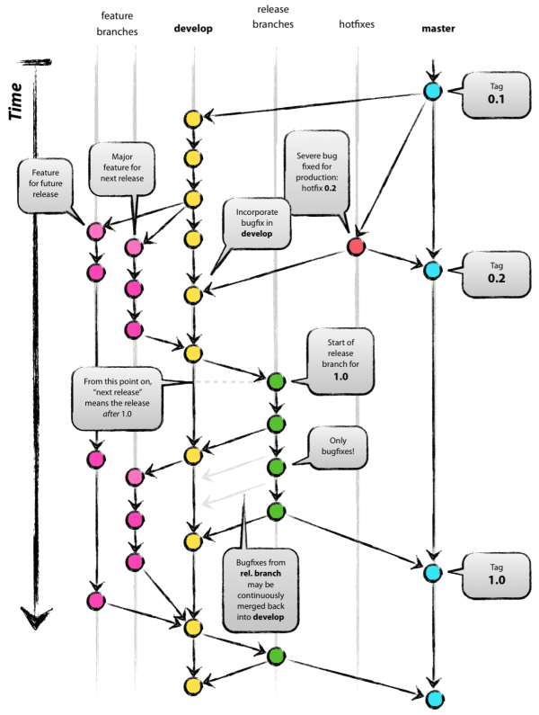
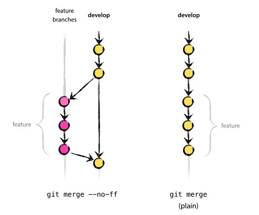
### 概念
远程仓库 -> 本地仓库 -> 项目
#### 常见操作流程

1. git clone
2. git commit
3. git master 主分支用于构建发布
4. git branch develop master 针对主干之路开辟分支用于解决特定问题
5. git checkout develop 切换到开发分支
6. 进行开发 或者 bug 修复
7. 团队个人操作 git fetch develop -> git checkout develop->git merge FETCH_HEAD / git pull develop develop 多人合作时,定时进行代码的合并,防止产生代码冲突
8.  团队leader git checkout -b release develop 使用最新开发版创建用于发布前内部测试组使用的发布分支 并切回develop
9.  团队leader git add -> git commit 提交develop的change至本地仓库
11. 团队leader git push origin develop 将最新版develop推送至远程仓库,并确定没有与他人冲突
13. 团队leader git merge --no-ff   保留合并流程
14. 团队leader git push origin release 将release版本推送至远程仓库 供测试人员下载使用
15. 确认没有问题 更新release版本分支至master并 打包 推送  master 和 tag 至远程仓库  | 如果master 已经在新版本开发过程中 直接跟据远程release制作tag并上传至远程仓库 后期在与 master合并
16. git checkout master -> git pull release master -> git tag v0.2 -> git push origin master -> git push origin --tags | 或者 git pull release release -> git checkout release -> git tag v0.2 -> git push (origin)--tags 

# Shell

## 服务器远程文件目录拷贝

### 命令

scp root@192.168.120.204:/opt/soft/nginx-0.5.38.tar.gz /opt/soft/

scp -r /opt/soft/ root@192.168.120.204:/opt/soft/

### 问题

使用root登入可能会被拒绝，设置参数为/etc/ssh/sshd_config中的PermitRootLogin 为 yes

需要给被操作的服务器文件目录登入用户的写权限

定时任务

crontab 

开机自启动 

或者注册成系统服务 systemctl 并设置为开机自启

rc.local

后台进程启动

nohup "execute command" &  //可以加入一些其他管道操作 比如  错误 和 正确 日志 输出到不同地方。

# 压力测试

## LoadRunner

重量级 收费

## Jemter

轻量级 开源

# 其他附件

[全球各大时区UTC](./books/Timezones.xlsx)

# Java常见知识

## Object

equals

hashCode()

当进行类重写时候 需要进行  复写 equals 与 hashCode

因为存在 hashCode冲突，所以可以说，equals相等这两个对象的 堆上的内容是一样的，同时hashCode也一定是一样的；但是hashCode一样，并不代表两个对象的堆上的内容是一样的，只能说是有可能，是不是有点相布隆过滤器的赶脚。

clone

实现Cloneable

复写clone方法，修改clone方法的修饰符为public供外部调用，内容调用super.clone()，并将返回类型设置为本类类型

但是这样拷贝出来的内容其实都是引用的同一个堆上的内容。如果不是基本类型或者其包装类 需要将其内部变量也重新实现Cloneable接口

为了实现深度拷贝

1. 可以层层实现Cloneable接口

2. 在顶层类实现 Serializable 中使用 序列化 与 反序列化 进行 对象的拷贝（注意使用此方法是需要将其涉及的类都是实现 Serializable   否则会报没有实现Serializable 的错误 从而拷贝出错）需要注意的是 类中的静态变量和 transient 变量是不会 被序列化的（此处的不能虚化列是不能将对象当前值序列化好，并不是类的信息 类似于 static 为null，应该为反序列化放当前类的static值）要想实现序列化 transient 和 static变量可以使用```Externalizable```实现自己的序列化方法

   ```java
   public Father clone() throws CloneNotSupportedException {
   
       Father fa = null;
   
       try {
           ByteArrayOutputStream byteArrayOutputStream = new ByteArrayOutputStream();
           ObjectOutputStream  objectOutputStream = new ObjectOutputStream(byteArrayOutputStream);
           objectOutputStream.writeObject(this);
           objectOutputStream.flush();
           ByteArrayInputStream byteArrayInputStream = new ByteArrayInputStream(byteArrayOutputStream.toByteArray());
           ObjectInputStream objectinputstream = new ObjectInputStream(byteArrayInputStream);
           fa =  (Father)objectinputstream.readObject();
       } catch (IOException | ClassNotFoundException e) {
           return fa;
       }finally {
           return fa;
       }
   
   }
   ```