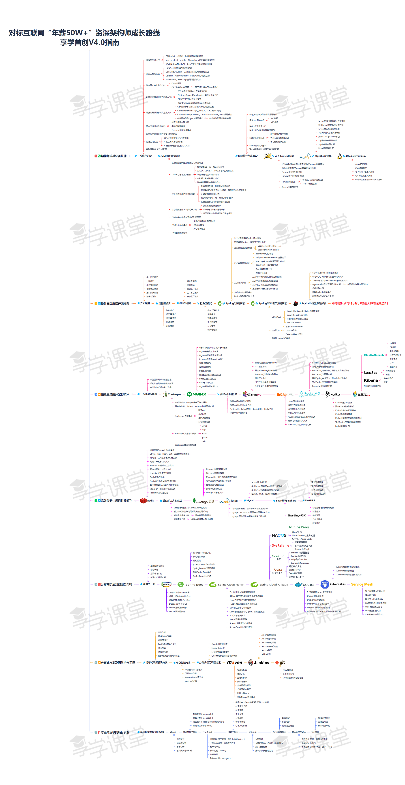

# 构师成长之路
## 前言
借用一下一张图


##  架构师筑基必备技能
### 并发编程进阶
#### 线程共享和协作

1. CPU核心数，线程数，时间片轮转机制解读

  

  - CPU核心数 

    CPU核心数分为 物理CPU，单CPU上的核心数，以及逻辑CPU，具体区别可以查询[CPU逻辑核心数和物理核心数是什么意思?](https://zhidao.baidu.com/question/568786289.html)	在Java 中可以通过 ```Runtime.getRuntime().availableProcessors()``` 获取为逻辑CPU的数量为我们所说的CPU核心数。

  - 线程数 线程是CPU可以调度的最小单元，对于多线程线程数量的合理设置就显得很关键了，线程数过少可能不能发挥CPU的全部效能，线程数过大又会产生上下文切换反而会降低效能。关于线程数量的设置，在我观察中一般有两种策略，一种较为笼统简单，还有一种较为精准，首先谈第一种策略

    ##### 简单策略

    将CPU的效能转换为完成任务所需时间，用时越少代表效能越高，设定```任务所需用时=CPU用时+IO用时```

    根据其中CPU用时和IO用时占比不同分为 CPU密集型 IO密集型。对用CPU密集型的任务，线程数设置为**CPU核心数+1**因为使用CPU的时间较多，不建议设置过多线程数，导致频繁切换上下文；对于IO密集型的线程数设置为**CPU核心数*2**，因为CPU会长时间处于空闲状态所以可以设置多一些线程数，增加CPU的使用效能。此种策略的简单方面有二，其一是设置线程数量的公式较为简陋，其二是没有考虑到系统的其他性能如文件句柄上限的数量等

    ##### 复杂策略

    可以参考[Programming Concurrency on the JVM](./books/Programming Concurrency on the JVM.pdf)中Page32的一段话

    ```
    Number of threads = Number of Available Cores / (1 - Blocking Coefficient)
    ```

    > where the blocking coefficient is between 0 and 1.
    >
    > A computation-intensive task has a blocking coefficient of 0, whereas an IO-intensive task has a value close to 1—a fully blocked task is doomed, so we don’t have to worry about the value reaching 1.
    >
    > To determine the number of threads, we need to know two things:
    >
    > • The number of available cores
    > • The blocking coefficient of tasks
    >
    > The first one is easy to determine; we can look up that information, even at runtime, as we saw earlier. It takes a bit of effort to determine the blocking coefficient. We can try to guess it, or we can use profiling tools or the java.lang.management API to determine the amount of time a thread spends on system/IO operations vs. on CPU-intensive tasks.

  ​      这里的```(Blocking Coefficient)阻塞系数=IO用时/CPU用时+IO用时```，这里还提到了可以使用```java.lang.management```包中的工具检测程序CPU的使用时间，相关的[ThreadMXBean API链接](https://docs.oracle.com/javase/8/docs/api/)我写了一个列子如代码清单1-1

  ```java
  import java.lang.management.ManagementFactory;
  import java.time.LocalTime;
  import java.util.concurrent.TimeUnit;
  
  public class TaskTest implements Runnable{
  
      private static volatile boolean loop = true;
  
      public void run() {
          LocalTime end = null;
          LocalTime start = LocalTime.now();
          int IOSUMTIME = 5;
          try{
              //CPU计算
              cal(1000000);
  
              //模拟IO用时
              TimeUnit.SECONDS.sleep(IOSUMTIME);
  
              end = LocalTime.now();
  
          }catch (Exception e) {
  
              e.fillInStackTrace();
  
          }finally {
              System.out.println("总计耗时: " +( end.toNanoOfDay() - start.toNanoOfDay() / 1000000000.0) + "s");
              double total_cpu = ManagementFactory.getThreadMXBean().getCurrentThreadCpuTime()/1000000000.0;
              double user_cpu = ManagementFactory.getThreadMXBean().getCurrentThreadUserTime()/1000000000.0;
              System.out.println("总CPU耗时: " + total_cpu + "s");
              System.out.println("用户态CPU耗时: "+user_cpu +"s");
              System.out.println("IO耗时:"+IOSUMTIME+"s");
              double block_efficent = IOSUMTIME/(IOSUMTIME+total_cpu);
              System.out.println("阻塞系数: "+block_efficent);
              int cores = Runtime.getRuntime().availableProcessors();
              System.out.println("系统可用逻辑CPU核心数量:" + cores);
              System.out.println("此任务最佳线程数: " + cores/(1-block_efficent));
  
          }
  
  
      }
  
  
      public void cal(long lopp_cyc){
  
          double sum = 0;
  
          for(int i = 0;i<lopp_cyc;i++){
  
              sum = sum + i * i + Math.pow(2.0,Double.valueOf(i));
  
          }
  
      }
  }
  ```

  <center>代码清单1-1</center>
  运行结果如下

  ```
  总计耗时: 7.2238589927767E13s
  总CPU耗时: 0.71567s
  用户态CPU耗时: 0.702647s
  IO耗时:5s
  阻塞系数: 0.8747880825869933
  系统可用逻辑CPU核心数量:4
  此任务最佳线程数: 31.945840960219083
  ```

* 时间片轮转机制

  时间片轮转机制即单个CPU核心会不停的切换不同的线程，进程进行运行，由此产生了上文所说的上下文切换的问题。

2. synchronized/volatile/ThreadLocal

  [Java8全部官方文档](https://docs.oracle.com/javase/8/docs/)

  * synchronized

    **原子性 顺序性 可见性**

    **可重入**

    [17.1 Synchronization](./books/jls8.pdf#page=660&zoom=100,0,89)

    > The Java programming language provides multiple mechanisms for
    > communicating between threads. The most basic of these methods is
    > synchronization, which is implemented using monitors. Each object in Java is
    > associated with a monitor, which a thread can lock or unlock. Only one thread at
    > a time may hold a lock on a monitor. Any other threads attempting to lock that
    > monitor are blocked until they can obtain a lock on that monitor. **A thread t may
    > lock a particular monitor multiple times; each unlock reverses the effect of one
    > lock operation.**

    此段文献中明确说明了同一个线程是可以对同一个监视器拿锁多次。

    **代码块 monitenter monitexit/方法 ACC_SYNCHRONIZED**

    在oracle JVM的说明中说明了synchronized底层的是细节

    [3.14 Synchronization](./books/jvms8.pdf)

    > Synchronization in the Java Virtual Machine is implemented by monitor entry and
    > exit, either explicitly (by use of the monitorenter and monitorexit instructions) or
    > implicitly (by the method invocation and return instructions).
    > For code written in the Java programming language, perhaps the most common
    > form of synchronization is the  synchronized method. **A  synchronized method is**
    > **not normally implemented using monitorenter and monitorexit. Rather, it is simply**
    > **distinguished in the run-time constant pool by the  ACC_SYNCHRONIZED flag, which**
    > **is checked by the method invocation instructions (§2.11.10).**

    此段说明了对于同步代码块使用的是monitorenter 与 monitorexit ,但对于同步方法略有不同使用的是常量池里的ACC_SYNCHRONIZED 标志位辨别同步。

    **死锁的发生**

  * volatile

    顺序性 可见性

    [JMM模型](https://www.jianshu.com/p/47f999a7c280)

    Happen Before原则

    - 单线程happen-before原则：在同一个线程中，书写在前面的操作happen-before后面的操作。
    - 锁的happen-before原则：同一个锁的unlock操作happen-before此锁的lock操作。
    - volatile的happen-before原则：对一个volatile变量的读操作happen-before对此变量的任意操作(当然也包括写操作了)。
    - happen-before的传递性原则：如果A操作 happen-before B操作，B操作happen-before C操作，那么A操作happen-before C操作。
    - 线程启动的happen-before原则：同一个线程的start方法happen-before此线程的其它方法。
    - 线程中断的happen-before原则：对线程interrupt方法的调用happen-before被中断线程的检测到中断发送的代码。
    - 线程终结的happen-before原则：线程中的所有操作都happen-before线程的终止检测。
    - 对象创建的happen-before原则：一个对象的初始化完成先于他的finalize方法调用。

    32位机器上 Long和Double的写诗非原子操作，读在JSR133后是原子操作之前也是非原子操作，因为Long和Double是4字节64位

  * ThreadLocal

    Thread->ThreadLocalMap->Entry[]->Entry WeakReference<ThreadLocal<?>>->key->value

    死锁 内存泄露

    数据库连接池的应用

3. wait/notify/notifyAll/Join

   wait/notify/notifyAll/Join 的底层实现也是基于mintoerenter 与 mointoerexit 所以必须要在同步代码块中进行使用   